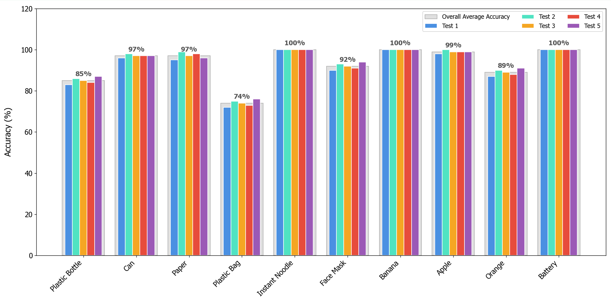
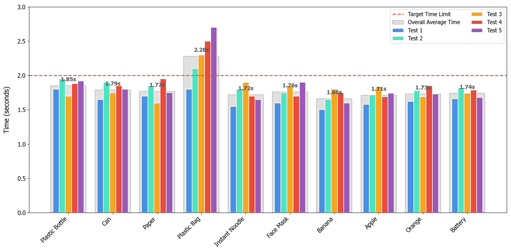
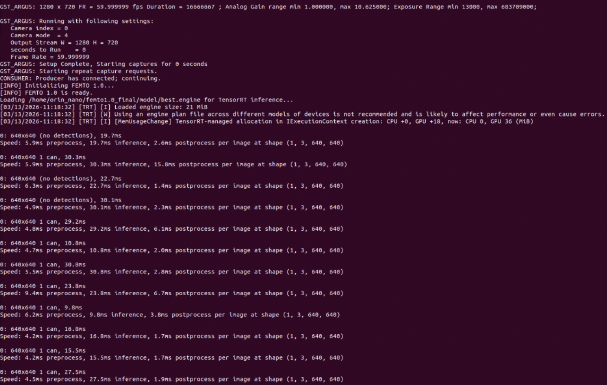
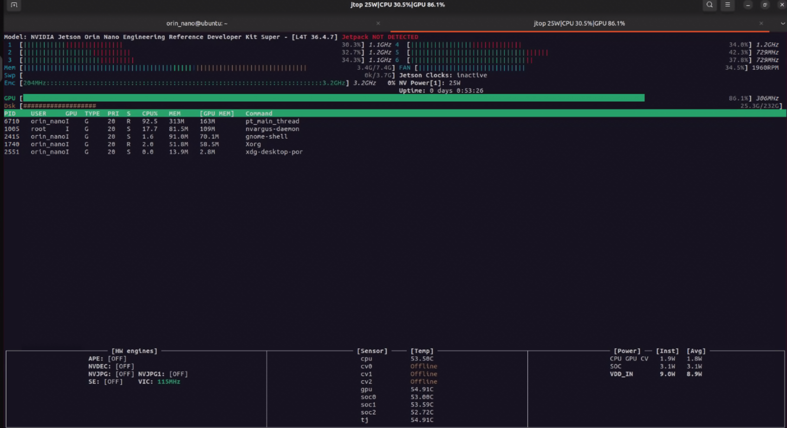

# Results

This document summarizes the real system test results of **Femto 1.0 — Edge AI Waste Classification System**, including software performance, hardware sorting performance, TensorRT runtime behavior, and Jetson runtime monitoring.

The software and hardware results in this document are based on tests from the actual deployed prototype across all 10 waste classes.

---

## 1. Overview

Femto 1.0 was evaluated using real system tests from both software and hardware perspectives.

The software performance test measures how accurately the deployed system classified waste items during real operation across the 10 waste classes. This result is not a YOLO validation metric such as mAP, precision, or recall.

The hardware performance test measures how long the physical sorting mechanism took to convey and sort each waste item into the target bin during real operation.

The two main overall results are:

| Metric | Result |
|---|---:|
| Overall software accuracy | 93.3% |
| Average hardware sorting time | 1.80 seconds / item |

The overall software accuracy is the average result across all 10 waste classes from the real software performance test.

The average hardware sorting time is the average time across all 10 waste classes from the real hardware sorting test.

---

## 2. Software Performance

The software performance test measures the system-level classification accuracy of the deployed system during real operation across the 10 waste classes.

This result represents the accuracy of the running system during actual testing, not a model validation metric such as mAP, precision, or recall.

### Detection Example

The example above shows the deployed YOLO model detecting a waste item during system operation. The detection result is then used by the system for class-to-category mapping and sorting decision logic.

### Software Accuracy Result

The system achieved an overall software accuracy of **93.3%** across all 10 waste classes.

| Waste Class | Accuracy |
|---|---:|
| Plastic Bottle | 85% |
| Can | 97% |
| Paper | 97% |
| Plastic Bag | 74% |
| Instant Noodle | 100% |
| Face Mask | 92% |
| Banana | 100% |
| Apple | 99% |
| Orange | 89% |
| Battery | 100% |

The strongest results were achieved on `Instant Noodle`, `Banana`, and `Battery`, each reaching 100% accuracy in the real software performance test.

The lowest-performing class was `Plastic Bag`, with 74% accuracy. This suggests that plastic bag detection was more difficult than other classes, likely due to shape variation, deformation, transparency, lighting changes, or visual similarity to the background.

---

## 3. Hardware Sorting Performance

The hardware performance test measures the real physical sorting time required for the mechanism to convey and sort each waste item into the target bin.

This result was measured from the actual sorting mechanism during real system operation.

The system achieved an average hardware sorting time of **1.80 seconds per item** across all 10 waste classes.

| Waste Class | Average Sorting Time |
|---|---:|
| Plastic Bottle | 1.50 s |
| Can | 1.50 s |
| Paper | 1.72 s |
| Plastic Bag | 2.28 s |
| Instant Noodle | 2.00 s |
| Face Mask | 1.56 s |
| Banana | 1.70 s |
| Apple | 1.72 s |
| Orange | 1.40 s |
| Battery | 1.62 s |

Most classes were sorted under or near the 2.00-second target line.

`Plastic Bag` showed the highest average sorting time at approximately **2.28 seconds**, making it the slowest class in the hardware test. This result indicates that lightweight or deformable objects may require more stable mechanical handling than rigid objects.

---

## 4. TensorRT Inference Runtime

The trained YOLO model was converted from `.pt` format to TensorRT `.engine` format for deployment on NVIDIA Jetson Orin Nano.

The runtime log shows that the system uses the TensorRT engine model during inference. The inference input size is 640×640, and the per-frame processing time is shown in the YOLO verbose output.

TensorRT deployment was used because it is more suitable for optimized inference on NVIDIA Jetson hardware than running the original `.pt` model directly.

The inference runtime includes:

- Preprocessing time
- Model inference time
- Postprocessing time

These values help identify where runtime latency occurs during real-time operation.

---

## 5. Jetson Runtime Monitoring

Jetson runtime behavior was monitored using `jtop` during system operation.

The monitoring result confirms that the system was running on NVIDIA Jetson Orin Nano and actively using Jetson hardware resources during operation.

The monitored resources include:

- CPU usage
- GPU usage
- RAM usage
- Power mode
- Running Python process
- GPU memory usage

This evidence supports that the system was deployed and tested on actual edge hardware, not only on a desktop or training environment.

---

## 6. Result Summary

| Evaluation Area | Result |
|---|---|
| Software performance | 93.3% overall software accuracy from real system testing |
| Hardware sorting performance | 1.80 seconds / item average sorting time from real physical testing |
| Model deployment format | TensorRT `.engine` |
| Runtime device | NVIDIA Jetson Orin Nano |
| Number of waste classes | 10 |
| Number of waste categories | 4 |

These results represent real system test results from the deployed prototype, not only model evaluation metrics.

The results show that Femto 1.0 can perform real-time waste detection, waste category mapping, and physical sorting on an edge device.

The system demonstrates a complete camera-to-actuator pipeline, where the AI prediction result is used to control an actual sorting mechanism.

---

## 7. Limitations

Although the system achieved stable overall performance, several limitations remain.

`Plastic Bag` had the lowest software accuracy and the highest hardware sorting time. This class is more difficult because plastic bags can deform, fold, reflect light, or appear in many different shapes.

The system currently works best when:

- One waste item is placed in the camera view at a time
- The object is visible clearly
- Lighting conditions are reasonably stable
- The item is positioned within the expected sorting area

The current decision logic intentionally rejects multiple detected objects in the same frame to avoid ambiguous sorting decisions.

---

## 8. Future Improvements

Future improvements may include:

- Expanding the dataset with more variations of difficult classes
- Improving performance on deformable objects such as plastic bags
- Testing under more lighting conditions
- Adding object position control before sorting
- Improving the mechanical structure for more stable item handling
- Testing with more real-world waste samples
- Adding more sensors to support physical sorting reliability
- Optimizing TensorRT inference and camera pipeline performance further

---

## 9. Conclusion

Femto 1.0 demonstrates a practical Edge AI waste classification and sorting system using YOLO, TensorRT, NVIDIA Jetson Orin Nano, CSI camera input, and servo-based actuation.

The system achieved **93.3% overall software accuracy** from real system testing and an average hardware sorting time of **1.80 seconds per item** from real physical sorting tests across all 10 waste classes.

These results show that the system is capable of connecting computer vision inference with real physical sorting behavior in an embedded edge AI environment.