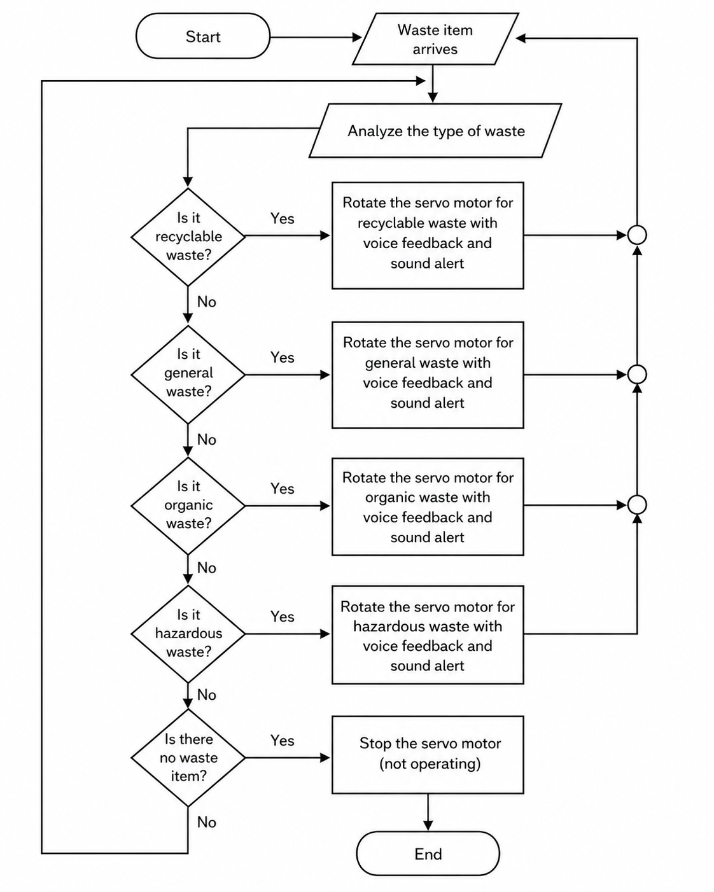
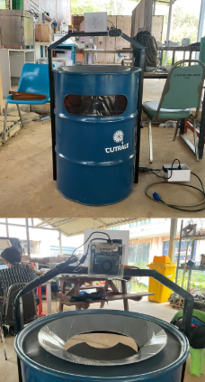
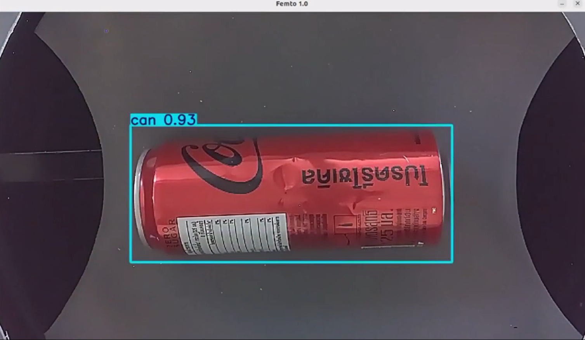

# System Architecture

This document explains the system architecture of **Femto 1.0 — Edge AI Waste Classification System**.

Femto 1.0 is designed as an end-to-end Edge AI system that combines computer vision, real-time inference, decision logic, physical actuation, voice feedback, and safe shutdown handling on NVIDIA Jetson Orin Nano.

---

## 1. Overview

The system receives image input from a CSI camera, detects the waste item using a YOLO object detection model, maps the detected class into a waste category, and controls a servo-based sorting mechanism to move the item into the correct bin.

The main goal of this architecture is to demonstrate a practical Edge AI pipeline that does not stop at model prediction, but also connects the prediction result to physical hardware control.

The system includes the following main functions:

- Camera-based image acquisition
- Motion-triggered YOLO inference
- TensorRT-based object detection
- Waste class-to-category mapping
- Consecutive detection buffering
- Servo-based physical sorting
- Voice feedback for user interaction
- Shutdown card detection for safe shutdown
- Resource cleanup for camera, GPIO, servo, and audio components

---

## 2. High-Level System Pipeline

```text
CSI Camera
    ↓
Frame Capture
    ↓
Motion Detection
    ↓
YOLO TensorRT Inference
    ↓
Waste Class Prediction
    ↓
Class-to-Category Mapping
    ↓
Decision Buffering
    ↓
Servo Angle Selection
    ↓
Physical Sorting Mechanism
    ↓
Voice Feedback / System Status
```



The pipeline is designed to run locally on the edge device. The Jetson Orin Nano performs camera input processing, AI inference, decision logic, and hardware control without requiring cloud inference.

---

## 3. Hardware Architecture



The hardware system consists of the following main components:

| Component | Purpose |
|---|---|
| NVIDIA Jetson Orin Nano | Main edge computing device for inference and control |
| CSI Camera | Captures waste item images for detection |
| Rotation Servo Motor | Rotates the sorting mechanism toward the target bin |
| Tilt Servo Motor | Tilts the mechanism to release the waste item |
| Speaker / Audio Output | Provides voice feedback and system alerts |
| Sorting Mechanism | Moves the detected waste item into the selected bin |
| Waste Bins | Receive waste items based on category |

The Jetson Orin Nano acts as the central controller. It receives image data from the CSI camera, performs YOLO inference using a TensorRT engine model, decides the target waste category, and controls the servo motors using PWM signals.

---

## 4. Software Architecture

The software architecture is organized around the main runtime pipeline.

| Module | Function |
|---|---|
| Camera Capture | Reads frames from the CSI camera using a GStreamer pipeline |
| Motion Detection | Detects frame movement before enabling YOLO inference |
| YOLO Inference | Performs object detection using a TensorRT `.engine` model |
| Class Mapping | Maps detected waste classes into sorting categories |
| Decision Buffer | Confirms stable predictions before triggering sorting |
| Servo Control | Controls rotation and tilt servos using PWM |
| Voice Feedback | Plays category-specific audio messages |
| Shutdown Detection | Detects a shutdown card and performs safe poweroff |
| Resource Cleanup | Releases camera, GPIO, PWM, and audio resources |

The main runtime application is implemented in `scripts/main.py`.

---

## 5. Camera and Motion Detection

The system uses a CSI camera as the input source. The camera is opened through a GStreamer pipeline to support Jetson camera input and hardware-accelerated video handling.

Motion detection is used before running YOLO inference. Instead of running the object detection model continuously, the system first checks whether there is movement in the camera frame.

The motion detection process follows this logic:

```text
Current Frame
    ↓
Convert to Grayscale
    ↓
Apply Gaussian Blur
    ↓
Compare with Previous Frame
    ↓
Threshold Frame Difference
    ↓
Count Changed Pixels
    ↓
Wake YOLO if Motion Exceeds Threshold
```

This design reduces unnecessary YOLO inference when no waste item is present in front of the camera. It also helps make the runtime loop more efficient on edge hardware.

---

## 6. YOLO TensorRT Inference

During development and training, the YOLO model is used in `.pt` format. For deployment on NVIDIA Jetson Orin Nano, the trained model is converted into TensorRT `.engine` format.

The TensorRT engine is used as the deployment model format for inference on the Jetson device.

```text
YOLO .pt Model
    ↓
TensorRT Export
    ↓
YOLO .engine Model
    ↓
Jetson Orin Nano Runtime Inference
```



At runtime, each active frame is passed to the YOLO model. The model returns detected objects, class names, and confidence scores. The system then uses these results for waste category mapping and sorting decisions.

The confidence threshold is configured in `configs/system_config.yaml`.

---

## 7. Waste Class Mapping

The YOLO model detects 10 waste classes. These classes are mapped into 4 main waste categories for sorting.

| Waste Category | Classes |
|---|---|
| Recyclable Waste | `plastic_bottle`, `can`, `paper` |
| General Waste | `plastic_bag`, `instant_noodle`, `mask` |
| Organic Waste | `banana`, `apple`, `orange` |
| Hazardous Waste | `battery` |

The class mapping is defined in:

```text
configs/class_mapping.yaml
```

The system also includes a special class:

```text
shutdown_card
```

The `shutdown_card` class is used only for safe system shutdown and is not counted as one of the 10 waste classes.

---

## 8. Decision Buffering Logic

The system does not immediately trigger sorting from a single-frame prediction. Instead, it uses a consecutive detection buffer to confirm that the detected class is stable.

This helps reduce unstable predictions, false triggers, and accidental servo activation.

The decision logic follows this process:

```text
YOLO Detection Result
    ↓
Check Number of Detected Objects
    ↓
Accept Only Single-Object Detection
    ↓
Compare Current Class with Previous Class
    ↓
Increase Consecutive Count if Class Matches
    ↓
Trigger Sorting When Count Reaches Buffer Size
```

If multiple objects are detected in the same frame, the system resets the current decision buffer. This prevents the mechanism from sorting when the scene is ambiguous.

After a sorting action is triggered, the system enters a short cooldown period before accepting the next sorting decision.

---

## 9. Servo-Based Sorting Mechanism

The physical sorting mechanism uses two servo motors controlled through PWM signals.

| Pin | Servo Role | Description |
|---|---|---|
| 32 | Rotation servo | Rotates the mechanism toward the target bin |
| 33 | Tilt servo | Tilts the mechanism to release the waste item |

The rotation servo on pin 32 is responsible for selecting the target bin direction. The tilt servo on pin 33 is responsible for releasing the waste item after the mechanism has rotated into position.

### Servo PWM Design

The rotation servo on pin 32 releases its PWM signal after movement. This design was used because holding the PWM signal continuously caused mechanical vibration and servo jitter during testing.

The tilt servo on pin 33 keeps its PWM signal active to maintain the mechanism position.

This design acts as a simple jitter mitigation strategy for the rotation mechanism.

---

## 10. Servo Movement Sequence

The servo movement is handled as an asynchronous sequence rather than a single blocking action.

The movement cycle is:

```text
1. Rotate toward the target bin using pin 32
2. Tilt the mechanism using pin 33
3. Return the tilt servo to the default position
4. Return the rotation servo to the default position
5. Release PWM on the rotation servo to reduce jitter
```

This sequence allows the main loop to continue updating the system while the servo movement is in progress.

The servo duty cycles are mapped by waste category. Example categories include:

```text
Recycle Waste
General Waste
Organic Waste
Hazardous Waste
```

The servo timing and duty-cycle mapping are configured in `configs/system_config.yaml`.

---

## 11. Voice Feedback System

The system includes audio feedback to communicate with the user during operation.

Voice feedback is used for:

- Startup notification
- Waste category result
- Shutdown alert

Each waste category has a corresponding audio message:

| Waste Category | Audio Feedback |
|---|---|
| Recycle Waste | Recyclable waste notification |
| General Waste | General waste notification |
| Organic Waste | Organic waste notification |
| Hazardous Waste | Hazardous waste notification |

The audio system improves user interaction by making the system response easier to understand during real-time operation.

Audio file paths are configured in `configs/system_config.yaml`.

---

## 12. Shutdown Card Detection

The system includes a shutdown card detection function for safe shutdown operation.

Instead of directly cutting power to the Jetson device, the system detects a special `shutdown_card` class using the YOLO model. When the shutdown card is detected continuously for a configured number of frames, the system plays a shutdown alert and then performs a system-level poweroff command.

The shutdown logic follows this process:

```text
Detect Shutdown Card
    ↓
Check Confidence Threshold
    ↓
Confirm Consecutive Detection
    ↓
Play Shutdown Alert
    ↓
Release Hardware Resources
    ↓
Execute System Poweroff
```

This approach helps reduce the risk of file corruption or hardware issues caused by directly disconnecting power.

The shutdown card confidence threshold, buffer size, and delay are configured in `configs/system_config.yaml`.

---

## 13. Resource Cleanup and Safety

The system includes cleanup logic to safely release hardware and software resources when the program exits.

The cleanup process includes:

- Releasing the camera
- Returning servos to their default positions
- Stopping PWM signals
- Cleaning up GPIO resources
- Stopping the audio mixer
- Handling keyboard interrupt and termination signals

This is important for embedded hardware systems because unreleased GPIO or PWM resources may cause unstable behavior in the next runtime session.

---

## 14. Design Considerations

Several design decisions were made to improve system stability and make the system more suitable for edge deployment.

| Design Decision | Reason |
|---|---|
| TensorRT `.engine` deployment | Provides an optimized deployment format for NVIDIA Jetson hardware |
| Motion-triggered inference | Reduces unnecessary YOLO processing when no object is present |
| Consecutive detection buffering | Reduces unstable predictions and false sorting actions |
| Single-object decision rule | Avoids sorting when the scene contains multiple detected objects |
| PWM release on rotation servo | Reduces mechanical jitter from the rotation mechanism |
| Shutdown card detection | Allows safe shutdown without directly cutting power |
| Resource cleanup | Prevents camera, GPIO, PWM, and audio resource issues |

These decisions make the system more practical for real-world edge AI operation, where both AI prediction quality and hardware behavior must be considered together.